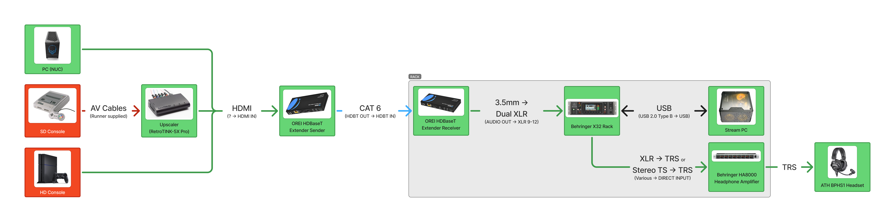
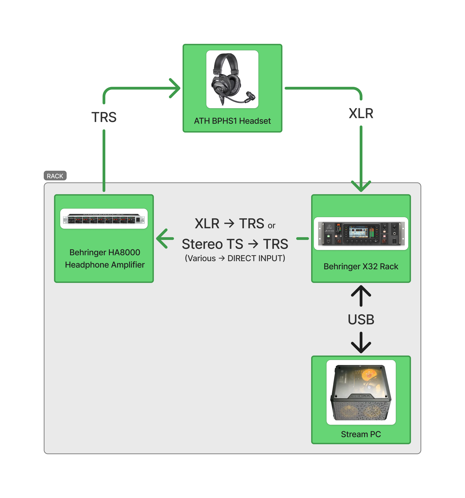

# Audio

For Audio you are in charge of how it sounds on stream and how it sounds in person (called Front Of House FOH).

**You need to pay attention to this mostly at the start of the runs. You're looking out for if the game is too loud/quiet or if the runners and commentators are too loud or quiet (normally they're too quiet). Adjust the volume as seen in Control.**

The audio system is a Behringer X32 Rack which is supplemented by automation that runs in NodeCG. There are 6 headsets and a speaker setup.

## Diagrams

### Game Audio

### Microphone/Headset Audio

## Headsets

- Runner/Commentator
  - Red "Mario"
  - Blue "Sonic"
  - Yellow "Pikachu"
  - Green "Link"
- Host
- Tech
  - Tech might just be a pair of headphones

## Control

To adjust the audio levels move the sliders (also known as faders) up and down to the desired level. Make sure you have either selected **Main** to adjust the stream audio or **Speakers** to adjust the speakers audio. If you adjust any other headsets you will be adjusting someone on stage! Only do that if you absolutely must.

## Automation

As the mixer is complicated, we have automated a lot of what you need to do.

- Transitioning to Runs
  - Fades in microphones in use and game 1
- Transitioning to Intermission
  - Fades out all microphones except host and game
- Transitioning to Credits
  - Fades in special mic
- Host muting/unmuting
  - Controlled by host on their dashboard

## Special Microphone

The special microphone is a handheld microphone used for the introduction and ending speech. It is also used for [[ASNN]] but that is a lot more manual.

## OBS

There are some sounds we need to get from OBS as they are played on a browser source or a video source. We need to get these sounds so they can play through the speakers and headsets. That means we need to go from OBS -> X32 -> OBS. It is a bit of a roundabout but it makes things easy.

We use the [obs-monitor-plugin](https://github.com/exeldro/obs-audio-monitor) to send these to the X32 via the USB interface.

Things that the obs monitor plugin need to be on is:

- Transition graphic
  - Transition jingle
- Intermission graphic
  - Rainwave.cc
- Any video sources that have audio

## Talkback

Talkback is a button on the mixer that lets the tech microphone broadcast to the runners and commentators. Please only use this *during intermissions when the host is not speaking* and only when ***absolutely necessary*** when during a run.

The reason we only want to use it only in emergencies essentially is that unless you have a lot of experience being a commentator in large productions, people aren't used to speaking AND listening to instructions. People tend to become deer in headlights and will actually miss what you said anyway.
