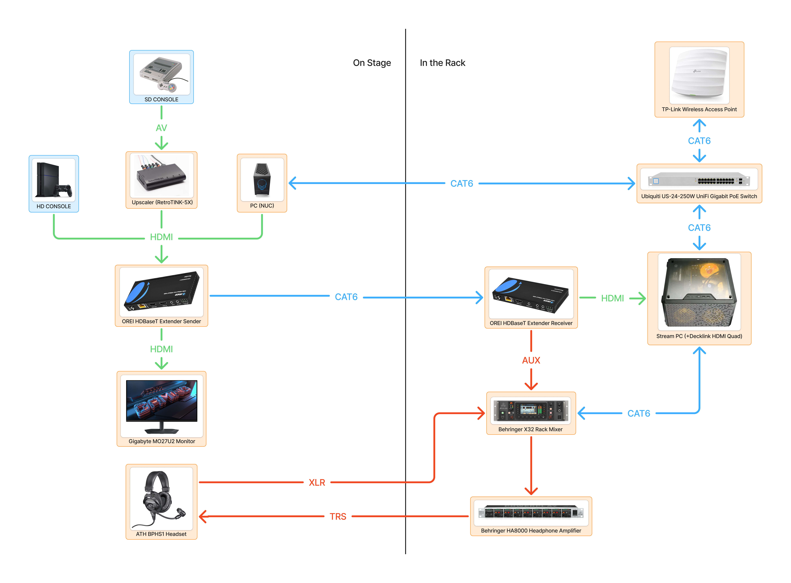

## Introduction

Welcome to the Tech Team!  
Our job is to keep the show running on schedule, and to provide every runner with the best setup we can.

---

## Roles

### Stream Tech

- Operates **OBS**, **NodeCG**, and the **X32** mixer  
- Balances audio and troubleshoots issues  
- Fills out the **paper checklist** each run  

> Stream Techs handle **software and troubleshooting**, and should also know how to do Stage Hand duties.

### Stage Hand

- Takes photos for social media  
- Finds the next runner and brings them to tech  
- Helps runners set up and pack down before their run  

> Stage Hands handle **basic hardware and assist talent**.

### Basic Wiring Diagram

- [Detailed Video Flow](./video-flow.md)
- [Detailed Audio Flow](./audio.md)
- [Detailed Networking Flow](./networking.md)

