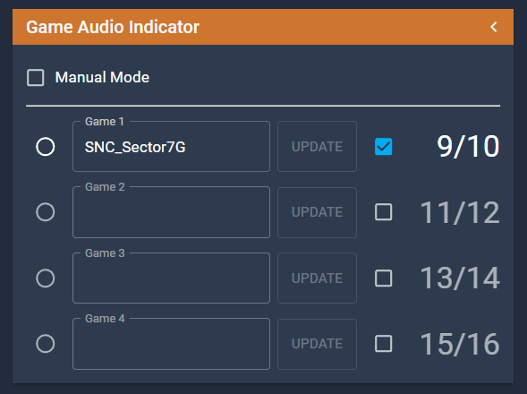

# Game Audio Indicator

**Controls whose audio is being played on stream.**

## Controls

### Manual Mode

When enabled this stops the X32 from automatic audio mixing.

### Radio Button

Controls which runner's audio will get used

### Update Button

Updates the Game Audio's name when edited

### Checkbox

Enables or Disables the game audio from showing in the Runner Dashboard and being selectable

### Numbers at the end

The X32 audio channel the games use.
