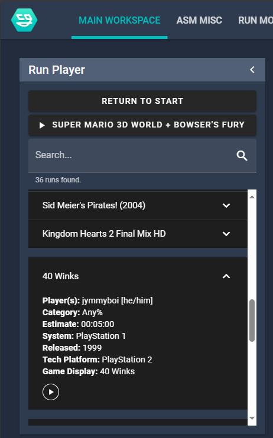
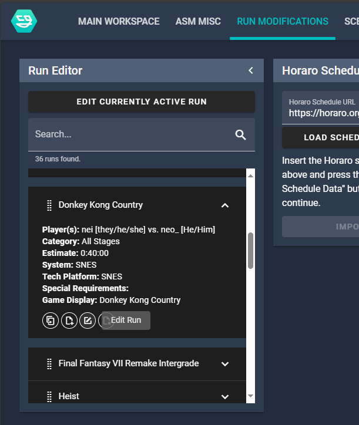
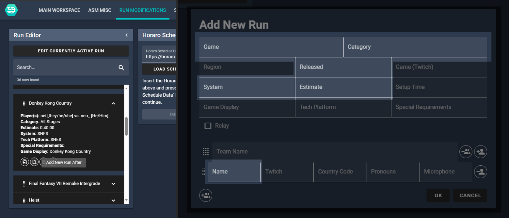
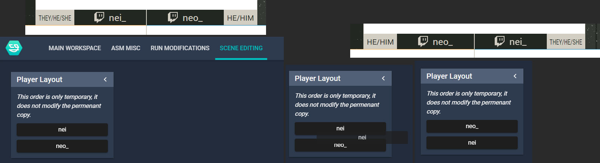

### Change the current run

1. Go to the **Main Workspace** tab
2. Find the run in **Run Player**
3. Click the run
4. Click play

### Edit a run

1. Go to the **Run Modifications** tab
2. Find the run in the list
3. Click the edit button
4. Edit the information needed
5. Save

### Add a run

1. Go to the **Run Modifications** tab
2. Find where the run will be placed on the list
3. On the run before it click the button with the tool tip "Add New Run After"
4. Fill in the information for the run
5. Save

:::note
Fields highlighted are the required fields.
:::

### Change the order of names

1. Go to the **Scene Editing** tab at the top.
2. Drag the runners names

### Change the game audio in a race/coop

Audio is automatically changed when changing the audio indicator on the runner. Try to have the person ahead in a race to have their audio enabled. Don't switch often, it's ok to ask beforehand who will most likely be in front to have their audio on first.

1. Go to the "Game Audio" panel
2. Select the runner

## NodeCG just crashed

The NodeCG bundles are designed to crash and recover automatically. If for whatever reason it is not follow these steps:

1. Open a terminal
2. Navigate to the Desktop folder and find the NodeCG folder
3. Type `node .`
4. If an error appears about an instance already running open Task Manager and kill any "Node.js JavaScript Runtime" processes.
5. Try `node .` again
6. If this still fails call Clubwho
