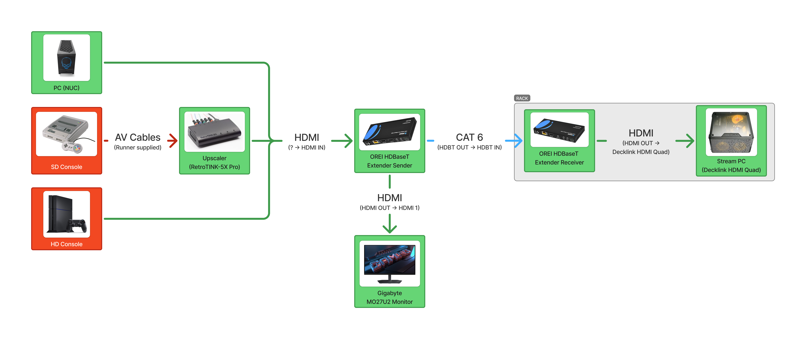
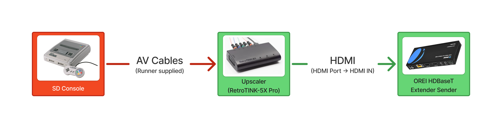
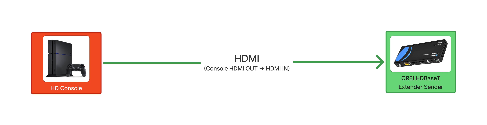
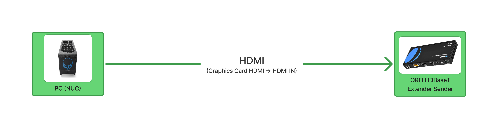

## Total Video Flow

- Red indicates the Runner bringing their own equipment.
- Green indicates AusSpeedruns equipment.

## Setups

The only cables you will need to move is the HDMI cable going INTO the OREI HDMI Extender. The following images show the setups for the different types of video sources.

### SD Console Setup

### HD Console Setup

### PC Setup

## Types of video sources

### SD Consoles

- PS1
- PS2
- NES
- Nintendo 64
- GameCube
- Nintendo Gameboy Advance (via GameCube Game Boy Player)
- Wii (in SD mode)
- Xbox
- Sega Master System
- Sega Genesis/Mega Drive
- Sega Saturn

### HD Consoles

- PS3
- PS4
- PS5
- Xbox 360
- Xbox One
- Xbox Series X/S
- Wii (in HD mode)
- Wii U
- SNES Classic
- Switch
- Switch 2

### PC

- PC
- Nintendo DS/3DS/2DS (via modded capture card)
  - Some DS capture cards require it to use the 3.5mm audio jack for audio output. Unplug the 3.5mm cable from the OREI HDMI Extender and plug it into the DS capture card.
- Emulators
